# Automatic Speech2Video video editing pipeline

Processing pipeline for turning input speech into full video. Can't capture every nuance of video editing but we'll try to get a majority of the busy work done.

We'll use singular embedding models here to embed text/images/video into just one embedding model at a time. The first will be a text/image only embedding model like Clip to produce videos with static images, this will be for more casual and demonstrative use - can suffice for many use cases and more devices. The 2nd will use an text/audio/images/video embedding model in order to incorporate video, this will be the Proper albeit more computationally intensive use.

We dont use audio embeddings because this is intended for narration. If I'm narrating a documentary about animals and my dog barks in the background of an audio clip it could erroneously bias that segment towards the dog embeddings even if that particular segment is supposed to be about Zebras.

## Architecture Diagram

Animated line = default pathway. Red diamond = ML model inference. Green = possible starting points. Yellow = external API. Pink = lightweight processing like NER. 

```mermaid
graph TD;
    %% mermaid chart docs: https://mermaid.js.org/syntax/flowchart.html
    AUDIO_UPLOAD(["Upload Speech"]) e7@--> SPEECH_DATA[("User Speech MP3")]

    SPEECH_DATA e22@-.->|Enhance Loop| PARAM8;
    PARAM8 e23@-.-> RESTORATIVE_AUDIO_ENHANCEMENT{"|nineninesix/diamond-1.0| Restore/enhance audio"};
    RESTORATIVE_AUDIO_ENHANCEMENT e24@-.-> SPEECH_DATA;
    
    %% doesn't need to be a facecam video, just a common example
    FACECAM_UPLOAD(["Upload Speech with video/facecam"])-->FACECAM_DATA["Facecam File"]
    FACECAM_DATA-->FACECAM_SPLIT["Split audio from video, keep time aligned"]
    FACECAM_SPLIT--Speech MP3-->SPEECH_DATA
    FACECAM_SPLIT--Visual only MP4-->FACECAM_VISUAL_DATA[("Facecam MP4")]

    SPEECH_DATA e6@--> AUDIO_PREPROCESSING{"Audio Preprocessing: remove long silences, normalize loudness if needed. May run Background noise removal (models fairly light like as low as 8mb) maybe include a bool for this as an option in case gives errors."};
    %% AUDIO_UPLOAD-->EMBED_AUDIO_INIT{"|e5-omni-3B| \n Audio Embeddings Generated."};
    AUDIO_PREPROCESSING e5@--> STT_MODEL{"Speech to Text processing with timestamps"};
    STT_MODEL e4@--> SENTENCE_DICTIONARY["Sentence/Timestamp Dictionary"];
    SENTENCE_DICTIONARY-->PARAM5;
    PARAM5-->EMBED_TEXT{"|all-MiniLM-L6-v2| \n Sentence Embeddings Generated."};
    
    GENERATE_IMAGES e17@-.-> IMAGE_UPLOAD
    IMAGE_UPLOAD(["Upload image assets"]) e14@--> VISUAL_FILE_DATA_EXTRACTION["Extract file name and textual metadata"];
    VIDEO_UPLOAD(["Upload video assets"])-->VISUAL_FILE_DATA_EXTRACTION;
    VISUAL_FILE_DATA_EXTRACTION e15@--> VISUAL_DATA[("Visual Assets Data")];
    VISUAL_DATA e16@--> EMBED_MULTIMODAL{"|Qwen3-VL-Embedding-2B| \n Sentence/Image/Video Embeddings Generated in MultiModal embedding. Generate text embeddings from Image/Video file names and/or file textual metadata."};

    EMBED_TEXT==Sentence/Timestamp/Text Embeds Dictionary==>AUDIO_SIMILARITY["Flag and remove overly similar neighboring sentences. Remove the first sentence as the latter is likely a correction."];
    AUDIO_SIMILARITY-->AUDIO_STOP["Remove STOP words and k sentences before the STOP word for which there is a similar sentence in range STOP_thresh after the STOP word."];

    AUDIO_STOP e21@-.-> NLP_FUNNEL_SEARCH_TERM_EXTRACTION;
    NLP_FUNNEL_SEARCH_TERM_EXTRACTION e9@-.-> PARAM3;
    NLP_FUNNEL_SEARCH_TERM_EXTRACTION e18@-.-> PARAM7;

    SEARCH_IMAGE_API e20@-.-> IMAGE_UPLOAD;

    %% AUDIO_STOP-->AUDIO_AGENT["Now that we have our core audio we can inject prompts into the pipeline to remove unwanted topics or whatever"];
    
    SENTENCE_DICTIONARY e1@-.-> AUDIO_STOP;
    SENTENCE_DICTIONARY -.-> AUDIO_CLIPPING;
    AUDIO_STOP e2@--> AUDIO_CLIPPING["Use timestamps to create a separate audio clip for each selected sentence"];
    AUDIO_CLIPPING-->PARAM6;
    AUDIO_CLIPPING e3@-.-> AUDIO_POSTPROCESSING;
    PARAM6-->EMBED_AUDIO{"|e5-omni-3B| \n Audio Embeddings Generated for each sentence clipping."};
    EMBED_AUDIO==Sentence/Timestamp/Text Embeds/Audio Embeds Dictionary==>AUDIO_ANALYSIS["Analyze audio embeddings for potential audio distortions, static, background noise, etc. Remove intolerable clips."]

    AUDIO_ANALYSIS-->AUDIO_POSTPROCESSING["Recombine audio clips into a single audio file, normalize audio. Recombine these with the initial facecam video, if one was included. After reconstruction is done, transform timestamps to fit their new places."];
    FACECAM_VISUAL_DATA-->AUDIO_POSTPROCESSING
    
    %% can technically do audio embed matching too here if it solves some issues but textual embeds should be focus for reasons mentioned elsewhere
    
    AUDIO_POSTPROCESSING-->MP3[("Post MP3 File")];
    AUDIO_POSTPROCESSING-->MP4[("Post MP4 File")];
    AUDIO_POSTPROCESSING e10@==> EMBED_MULTIMODAL
    
    EMBED_MATCHING["Match sentence embeds to image/video. Maybe have a matching_threhold to encourage video use if the video is close enough. Create rankings according to Control Params & Rules"];

    MP3-.IF NO VISUALS were provided generate a blank image to make an mp4.->DONE;
    MP4-.if only visual is facecam.->DONE;

    MP3-->MOVIE_MAKING;
    MP4--put facecam in corner-->MOVIE_MAKING

    EMBED_MULTIMODAL e11@==Visual filenames/Visual Embeds/Video Length/ File data textual embeds Dictionary==> EMBED_MATCHING;

    EMBED_MATCHING e12@--> MOVIE_MAKING["Combine the audio and visuals according to embed rankings and Control Params & Rules"];

    MOVIE_MAKING e13@--> DONE(("DONE!"));

    NLP_FUNNEL_SEARCH_TERM_EXTRACTION{"Search Term Extracion using lighter nltk/spacy nlp methods."}
    
    PARAM1(["Optional: Set custom speech sentence similarity thresholds"])-.->AUDIO_SIMILARITY;
    PARAM2(["Optional: Set STOP words"])-.->AUDIO_STOP;
    PARAM3(["Optional:Set generate_images==True"]) e8@-.-> GENERATE_IMAGES{"|Z-Image-Turbo| \n Generate images from pruned sentence dictionary (from text not embeds)"};
    PARAM4(["Optional:Set min_visual_change_time or min_visual_change_num_sentences. Minimum time/numberof sentences any visual has to stay on screen. This prevents the visuals from changing too fast. "])-.->MOVIE_MAKING;
    PARAM5(["Optional: Set remove_similar_sentences to TRUE"]);
    PARAM6(["Optional: Set scrub_audio to true to use audio embeds to scrub bad audio"]);
    PARAM7(["Optional: Use SERP API image search."]) e19@-.-> SEARCH_IMAGE_API{"SERP IMAGE API"};
    PARAM8(["Optional: Use restorative_audio_enhancement"]);

    e1@{ animate: true }
    e2@{ animate: true }
    e3@{ animate: true }
    e4@{ animate: true }
    e5@{ animate: true }
    e6@{ animate: true }
    e7@{ animate: true }
    e8@{ animate: true }
    e9@{ animate: true }
    e10@{ animate: true }
    e11@{ animate: true }
    e12@{ animate: true }
    e13@{ animate: true }
    e14@{ animate: true }
    e15@{ animate: true }
    e16@{ animate: true }
    e17@{ animate: true }
    e18@{ animate: true }
    e19@{ animate: true }
    e20@{ animate: true }
    e21@{ animate: true }
    e22@{ animate: true }
    e23@{ animate: true }
    e24@{ animate: true }
    %% e25@{ animate: true }
    %% e26@{ animate: true }
    %% e27@{ animate: true }
    %% e28@{ animate: true }
    %% e29@{ animate: true }

    style FACECAM_UPLOAD stroke:green;
    style AUDIO_UPLOAD stroke:green;
    %% style EMBED_AUDIO_INIT stroke:red;
    style EMBED_TEXT stroke:red;
    style EMBED_MULTIMODAL stroke:red;
    style GENERATE_IMAGES stroke:red;
    style RESTORATIVE_AUDIO_ENHANCEMENT stroke:red; 
    style SEARCH_IMAGE_API stroke:yellow;
    style NLP_FUNNEL_SEARCH_TERM_EXTRACTION stroke:pink;
    style AUDIO_POSTPROCESSING stroke:blue;

```




## Saving to XML / json
Write to some xml standard if we can. If no standard is wide enough just output the vid and clips. 

Write to json. E.g. {{'time', 'image', 'effect' .....}, {'time', 'audio', .....}}. From here we can write scripts to change to markdown language for other video editors or easy translation to straightup code for other preogrammatic editors. Keep audio/video/image assets in separate eleements even if they share exact same times - this allows easier portability to other editors and easier editing. 

## Setup 

```
pip install faster-whisper sentence-transformers nltk pydub numpy scikit-learn
# pydub needs FFmpeg installed on your system
```

### Background Noise removal models

https://huggingface.co/mlx-community/DeepFilterNet-mlx

https://build.nvidia.com/nvidia/bnr/modelcard

### Image/Video file metadata embeddings 
We embed textual metadata and filenames too so users can more easily use novel data in this pipeline. E.g. if they're talking about their dog named snowball they can just name the file after the dog so the pipeline can use the dog image when given only a name. 

Might want to weight these heavier if within a certain similarity distance. Or save additional snippets elsewhere if its sufficiently close to the embedding of a competing image. 


### Similarity

Remove similar sentences within a sentence distance `similarity_sentence_distance = 10` and/or time range `similarity_time_range = 20.0` (default number of seconds as a float)

### STOP words 

Remove STOP words and k sentences before the STOP word for which there is a similar sentence in range `STOP_thresh` after the STOP word. We can assume that if a similar sentence is retreaded in ~ 1 paragraph after the STOP word then that new sentence is intended to replace the original. 

`STOP_thresh= 10` will be the default, adjust as needed. 

### Control Params & Rules
`min_relevance` parameter to control how relevant a video/image needs to be before its shown. Only used when user provides and inital video. E.g. if a facecam is provided and we set a min_relevance then we'll only show the face cam unless the relevance threshold is met. 

`matching_threhold` - if a video embed is close enough to a higher ranking image embed use this to give preference to videos. Set to 0 to just have the top embed win even if its an image

`limit_uses_to_once=True` limits the usage of each visual item to 1 appearance

`min_visual_change_num_sentences` minimum number of sentences a visual must remain on screen. If `loop_videos=false` videos should still end if theyre shorter than this time

`min_visual_change_time` minimum time a visual must remain on screen. If `loop_videos=false` videos should still end if theyre shorter than this time

`cut_videos=False` Set to true to cutoff videos if a higher ranking embed starts. `min_visual_change_num_sentences` and `min_visual_change_time` will apply before this. 

`loop_videos=false` set to true to make videos loop to fill out the interval alotted. If false itll just move on to the next visual 


# Resources

## Models

### Embedding Models

* [Qwen3-VL-Embedding-8B](https://huggingface.co/Qwen/Qwen3-VL-Embedding-8B) - multimodal text/image/video embeds. Fairly high on current benchmarks. And qwen series has more community support.
* [Qwen3-VL-Embedding-2B](https://huggingface.co/Qwen/Qwen3-VL-Embedding-2B) - Lighter Qwen model fairly close to 8B on benchmarks. 
* [e5-omni-3B](https://huggingface.co/Haon-Chen/e5-omni-3B) - Multimodal embeds for text, images, audio, and video, adding Audio to pipeline. Built on Qwen2.5-Omni-3B so carries over lots of qwen pipeline. 
* [e5-omni-7B](https://huggingface.co/Haon-Chen/e5-omni-7B) - heavier e5 variant
* [all-MiniLM-L6-v2](https://huggingface.co/sentence-transformers/all-MiniLM-L6-v2) - legacy but still good sentence embedding model
* [CLIP](https://huggingface.co/openai/clip-vit-base-patch32)

Multimodal Embedding Benchmark: https://huggingface.co/spaces/TIGER-Lab/MMEB-Leaderboard

### Speech-to-Text

We use `pip install faster-whisper` for speech transcription

### Restorative Audio Enhancement

We use [nineninesix/diamond-1.0](https://huggingface.co/nineninesix/diamond-1.0) for audio enhancement. The model purports "Diamond turns degraded audio into near-studio 44.1 kHz speech" and does seem to enhance audio from their examples. Although I personally don't have much of an ear for professional grad audio so you might want to split test yours. 

This is on by default. Set `"restorative_audio_enhancement": false` in `settings.json` to turn this off.

We'll leave the original audio unadultered and simply append `_diamond_enhanced.mp3` to the audio file name if `"restorative_audio_enhancement": true` and likewise work with this file later in the pipeline if `"restorative_audio_enhancement": true`

One of the smaller models ~670MB so no huge reason to leave it off by default. 

## API vs Local Inference

Some of the models we use here aren't supported by inference api services. APIs are iffy on audio/video/multimedia embedding models. And models like [nineninesix/diamond-1.0](https://huggingface.co/nineninesix/diamond-1.0) have pipelines that makes cloud inference impractical (but its fairly light so local inference is not too cumbersome). So we use a mixture of local/api inference. We'll default to doing small model and embedding inference locally. And shooting heavy LLM inference or large batch inference jobs to apis, defaulting to openrouter.

### Running on API
- LLM
    - [openai/gpt-5.6-luna-pro](https://openrouter.ai/openai/gpt-5.6-luna-pro)
- Image
    - [Seedream-5-0-pro](https://openrouter.ai/bytedance-seed/seedream-5-0-pro)
    - [Krea-2-large](https://openrouter.ai/krea/krea-2-large)
    - [Google Nano Banana 2 / gemini-3.1-flash-image](https://openrouter.ai/google/gemini-3.1-flash-image)
- Embeds
    - [qwen/qwen3-embedding-8b](https://openrouter.ai/qwen/qwen3-embedding-8b)
        - text/image


### Running Locally
- Speech Enhancement
    - [nineninesix/diamond-1.0](https://huggingface.co/nineninesix/diamond-1.0)
        - This is a unique type of model with its own unique inference pipeline, and pretty small by modern standards, local inference is more practical in most cases
- Embeds
    - [CLIP](https://huggingface.co/openai/clip-vit-base-patch32)
        - text/image 
        - [more docs/usage](https://huggingface.co/docs/transformers/en/model_doc/clip)
        - very performant on consumer devices plus i've used it more so easier to debug if needed 
    - [all-MiniLM-L6-v2](https://huggingface.co/sentence-transformers/all-MiniLM-L6-v2)
        - sentence-oriented text embeddings
        - fairly old embed model, still performant
    - [Qwen3-VL-Embedding-2B](https://huggingface.co/Qwen/Qwen3-VL-Embedding-2B) 
        - text/image
        - Lighter Qwen model fairly close to 8B on benchmarks. 
    - [e5-omni-3B](https://huggingface.co/Haon-Chen/e5-omni-3B)
        - text/image/audio/video
    - [e5-omni-7B](https://huggingface.co/Haon-Chen/e5-omni-7B)
        - text/image/audio/video

Prefer [all-MiniLM-L6-v2](https://huggingface.co/sentence-transformers/all-MiniLM-L6-v2) for local text.

Prefer [CLIP](https://huggingface.co/openai/clip-vit-base-patch32) for local text/image.

Prefer [e5-omni-3B](https://huggingface.co/Haon-Chen/e5-omni-3B) for local text/image/audio/video.

### API Providers
[OpenRouter](https://openrouter.ai/) - default where we have a matching model. Fairly industry standard. 

[Replicate](https://replicate.com/explore) has a great variety of models including multimodal embeddings. Including [CLIP](https://replicate.com/krthr/clip-embeddings) and [Qwen3-8b](https://replicate.com/lucataco/qwen3-embedding-8b) and multimodal models like [imagebind](https://replicate.com/daanelson/imagebind). But as you can see in these examples, embedding api lacks consistent structure since apis are created by users or orgs, so be sure to adjust accordingly. I love replicate personally but it was fairly recently acquired as of making this project so IDK how consistent and long-lasting the service is gonna be - have to give that a bit of time. If project gets traction and replicate is fairly stable in a bit I might just make replicate APIs for all models I use here. 


## Data

In this repo we'll use [feudalism.mp3](https://dn721507.ca.archive.org/0/items/historyofthemiddleages_2507_librivox/historyofthemiddleages_06_munro_128kb.mp3) from [internet archive](https://archive.org/details/historyofthemiddleages_2507_librivox)
## Datasets
* https://github.com/huggingface/dataspeech
* https://huggingface.co/datasets/MLCommons/peoples_speech
* https://github.com/thuhcsi/SpeechCraft
* https://github.com/google-deepmind/librispeech-long
* https://github.com/Yuan-ManX/ai-audio-datasets
* https://huggingface.co/datasets/nvidia/LongAudio

## Easy to use longform speeches
Search engines tend to make mp3's hard to find. Some resources here. 
* https://archive.org/details/audio
* https://www.csun.edu/science/ref/audio/index.html
* https://commons.wikimedia.org/wiki/Category:Audio_files_of_speeches