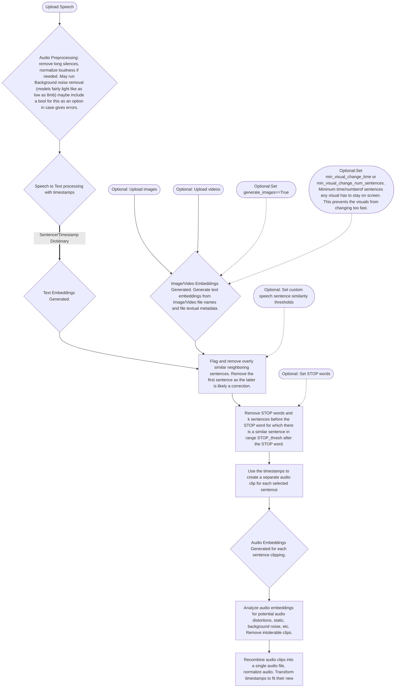

# peyote-speech2video

Processing pipeline for turning input speech into full video. Can't capture every nuance of video editing but we'll try to get a majority of the busy work done.

We'll use singular embedding models here to embed text/images/video into just one embedding model at a time. The first will be a text/image only embedding model like Clip to produce videos with static images, this will be for more casual and demonstrative use - can suffice for many use cases and more devices. The 2nd will use an text/audio/images/video embedding model in order to incorporate video, this will be the Proper albeit more computationally intensive use.

We dont use audio embeddings because this is intended for narration. If I'm narrating a documentary about animals and my dog barks in the background of an audio clip it could erroneously bias that segment towards the dog embeddings even if that particular segment is supposed to be about Zebras.

### Background Noise removal models

https://huggingface.co/mlx-community/DeepFilterNet-mlx

https://build.nvidia.com/nvidia/bnr/modelcard

### Image/Video file metadata embeddings 
We embed textual metadata and filenames too so users can more easily use novel data in this pipeline. E.g. if they're talking about their dog named snowball they can just name the file after the dog so the pipeline can use the dog image when given only a name. 

Might want to weight these heavier if within a certain similarity distance. Or save additional snippets elsewhere if its sufficiently close to the embedding of a competing image. 

### Similarity

Remove similar sentences within a sentence distance `similarity_sentence_distance = 10` and/or time range `similarity_time_range = 20.0` (default number of seconds as a float)

### STOP words 

Remove STOP words and k sentences before the STOP word for which there is a similar sentence in range `STOP_thresh` after the STOP word. We can assume that if a similar sentence is retreaded in ~ 1 paragraph after the STOP word then that new sentence is intended to replace the original. 

`STOP_thresh= 10` will be the default, adjust as needed. 