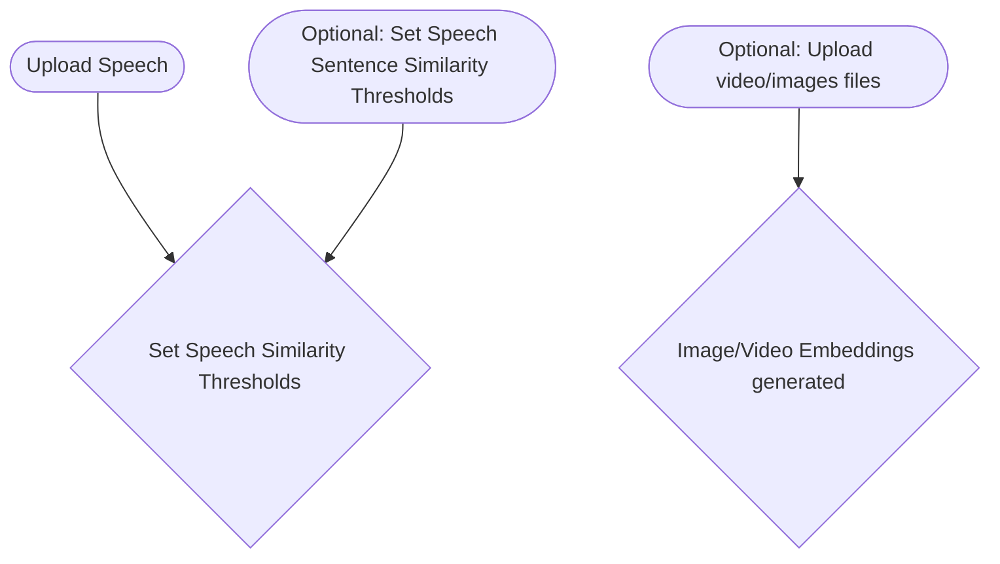

# peyote-speech2video

Processing pipeline for turning input speech into full video

We'll use 2 singular embedding models here to embed text/images/video into just one embedding model at a time. The first will be a text/image only embedding model like Clip to produce videos with static images. The 2nd will use an text/images/video embedding model in order to incorporate video. 

