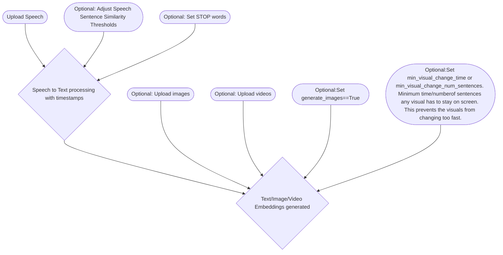

# peyote-speech2video

Processing pipeline for turning input speech into full video

We'll use 2 singular embedding models here to embed text/images/video into just one embedding model at a time. The first will be a text/image only embedding model like Clip to produce videos with static images. The 2nd will use an text/images/video embedding model in order to incorporate video. 

We dont use audio embeddings because this is intended for narration. If I'm narrating a documentary about animals and my dog barks in the background of an audio clip it could erroneously bias that segment towards the dog embeddings even if that particular segment is supposed to be about Zebras.

