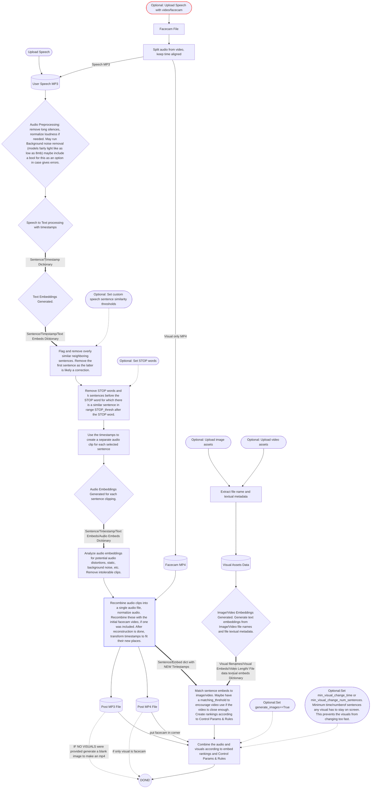

# Architecture Diagram

```mermaid
graph TD;
    %% mermaid chart docs: https://mermaid.js.org/syntax/flowchart.html
    AUDIO_UPLOAD(["Upload Speech"])-->SPEECH_DATA[("User Speech MP3")]
    
    %% doesn't need to be a facecam video, just a common example
    FACECAM_UPLOAD(["Optional: Upload Speech with video/facecam"])-->FACECAM_DATA["Facecam File"]
    FACECAM_DATA-->FACECAM_SPLIT["Split audio from video, keep time aligned"]
    FACECAM_SPLIT--Speech MP3-->SPEECH_DATA
    FACECAM_SPLIT--Visual only MP4-->FACECAM_VISUAL_DATA[("Facecam MP4")]

    SPEECH_DATA-->AUDIO_PREPROCESSING{"Audio Preprocessing: remove long silences, normalize loudness if needed. May run Background noise removal (models fairly light like as low as 8mb) maybe include a bool for this as an option in case gives errors."};
    %% AUDIO_UPLOAD-->EMBED_AUDIO_INIT{"Audio Embeddings Generated."};
    AUDIO_PREPROCESSING-->STT_MODEL{"Speech to Text processing with timestamps"}
    STT_MODEL==Sentence/Timestamp Dictionary==>EMBED_TEXT{"Text Embeddings Generated."};
    
    IMAGE_UPLOAD(["Optional: Upload image assets"])-->VISUAL_FILE_DATA_EXTRACTION["Extract file name and textual metadata"];
    VIDEO_UPLOAD(["Optional: Upload video assets"])-->VISUAL_FILE_DATA_EXTRACTION;
    VISUAL_FILE_DATA_EXTRACTION-->VISUAL_DATA[("Visual Assets Data")];
    VISUAL_DATA-->EMBED_IMAGE_VIDEO{"Image/Video Embeddings Generated. Generate text embeddings from Image/Video file names and file textual metadata."};

    EMBED_TEXT==Sentence/Timestamp/Text Embeds Dictionary==>AUDIO_SIMILARITY["Flag and remove overly similar neighboring sentences. Remove the first sentence as the latter is likely a correction."];
    AUDIO_SIMILARITY-->AUDIO_STOP["Remove STOP words and k sentences before the STOP word for which there is a similar sentence in range STOP_thresh after the STOP word."];

    %% AUDIO_STOP-->AUDIO_AGENT["Now that we have our core audio we can inject prompts into the pipeline to remove unwanted topics or whatever"];
    
    AUDIO_STOP-->AUDIO_CLIPPING["Use the timestamps to create a separate audio clip for each selected sentence"];
    AUDIO_CLIPPING-->EMBED_AUDIO{"Audio Embeddings Generated for each sentence clipping."};
    EMBED_AUDIO==Sentence/Timestamp/Text Embeds/Audio Embeds Dictionary==>AUDIO_ANALYSIS["Analyze audio embeddings for potential audio distortions, static, background noise, etc. Remove intolerable clips."]

    AUDIO_ANALYSIS-->AUDIO_POSTPROCESSING["Recombine audio clips into a single audio file, normalize audio. Recombine these with the initial facecam video, if one was included. After reconstruction is done, transform timestamps to fit their new places."];
    FACECAM_VISUAL_DATA-->AUDIO_POSTPROCESSING
    
    %% can technically do audio embed matching too here if it solves some issues but textual embeds should be focus for reasons mentioned elsewhere
    
    AUDIO_POSTPROCESSING-->MP3[("Post MP3 File")];
    AUDIO_POSTPROCESSING-->MP4[("Post MP4 File")];
    AUDIO_POSTPROCESSING==Sentence/Embed dict with NEW Timestamps==>EMBED_MATCHING["Match sentence embeds to image/video. Maybe have a matching_threhold to encourage video use if the video is close enough. Create rankings according to Control Params & Rules"];

    MP3-.IF NO VISUALS were provided generate a blank image to make an mp4.->DONE;
    MP4-.if only visual is facecam.->DONE;

    MP3-->MOVIE_MAKING;
    MP4--put facecam in corner-->MOVIE_MAKING

    EMBED_IMAGE_VIDEO==Visual filenames/Visual Embeds/Video Length/ File data textual embeds Dictionary==>EMBED_MATCHING;

    EMBED_MATCHING-->MOVIE_MAKING["Combine the audio and visuals according to embed rankings and Control Params & Rules"];

    MOVIE_MAKING-->DONE(("DONE!"));
    
    PARAM1(["Optional: Set custom speech sentence similarity thresholds"])-.->AUDIO_SIMILARITY;
    PARAM2(["Optional: Set STOP words"])-.->AUDIO_STOP;
    PARAM3(["Optional:Set generate_images==True"])-.->MOVIE_MAKING;
    PARAM4(["Optional:Set min_visual_change_time or min_visual_change_num_sentences. Minimum time/numberof sentences any visual has to stay on screen. This prevents the visuals from changing too fast. "])-.->MOVIE_MAKING;

    style FACECAM_UPLOAD stroke:red;
    style AUDIO_POSTPROCESSING stroke:blue;

```